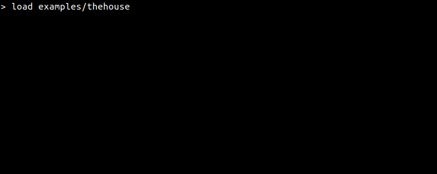

# Adventure

<!-- TOC -->

- [Adventure](#adventure)
  - [Overview](#overview)
  - [Installing adventure](#installing-adventure)
  - [Playing a game](#playing-a-game)
  - [Creating games](#creating-games)
  - [Adventure API](#adventure-api)

<!-- /TOC -->

## Overview

Adventure is a game engine for [text adventures](https://en.wikipedia.org/wiki/Interactive_fiction). 

It lets you create interactive fiction without needing to learn how to program.
Games are written in a declarative language instead which is used to define the 
game world and the actions within it.



## Installing adventure

Make sure you have [NodeJS](https://nodejs.org/) installed. Then run:

```
npm install -g https://github.com/maelys-mcardle/adventure
```

## Playing a game

An interactive console for the engine be started with the command:

```bash
adventure
```

The game will present an empty prompt. You can load a new story 
with the `load` command:

```
> load path/to/story
```

Use the `help` command to get a listing of all possible commands.

## Creating games

Games in Adventure are called stories. The [documentation](documentation) 
directory contains information on how to write these. The [examples](examples) 
directory contains stories written for the game, that you can peruse to see 
how they're put together.

## Adventure API

You can also integrate Adventure in your own [NodeJS](https://nodejs.org/) 
projects.

Install Adventure inside your project by running the following command:

```bash
npm install --save maelys-mcardle/adventure
```

Then you can use the game engine in your code:

```js
'use strict';

// Import the module for the Adventure API.
const adventure = require('adventure');

// Loads a story from a directory. Here it loads a sample.
let story = adventure.loadStory('node_modules/adventure/examples/thehouse');

// Get the output from the story in its initial state.
let text = adventure.getStoryOutput(story);
console.log(text);

/* Output:
[ 'You are in the bedroom. It hasn\'t changed since your childhood.
   Your pink bed sheets. The blue walls. Your plush animals. Your polly pocket 
   and transformers lining the shelves. Traces of your teenage self - the boxes
   of video games you kept perfectly. The computer you built, and rebuilt. An 
   entire life that suddenly stops midway through university.',
  'A letter is on the bedside table.' ]
*/

// Get examples of eligible inputs that the player could use.
// It provides one example per unique thing the protagonist can do.
let inputExamples = adventure.getInputExamples(story);
console.log(inputExamples);

/* Output:
[ 'go to the upstairs hallway',
  'read the letter',
  'describe world' ]
*/

// Alternatively, get all the eligible inputs that the player could use.
let allEligibleInputs = adventure.getAllInputs(story);
console.log(allEligibleInputs);

/* Output:
[ 'go to the upstairs hallway',
  'go to upstairs hallway',
  'go the upstairs hallway',
  'go upstairs hallway',
  'travel to the upstairs hallway',
  ...
  'inspect at the world',
  'examine world',
  'examine at world',
  'examine the world',
  'examine at the world' ]
*/

// Execute a player input, which will move the story forward.
[story, text] = adventure.evaluateInput(story, 'walk to upstairs hallway');
console.log(text);

/* Output:
[ 'You are in the upstairs hallway. Paintings line the wall.' ]
*/
```