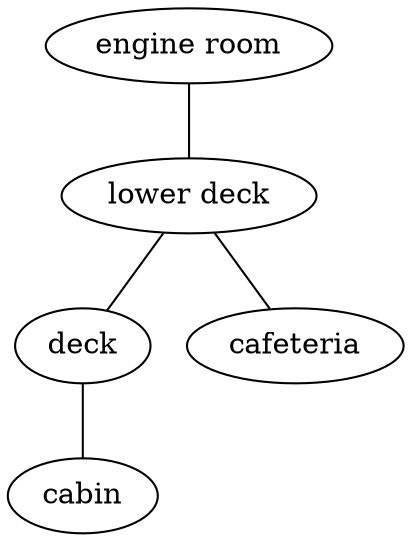

# Entities

In Adventure, every _thing_ in a story is defined in an entity. The world the 
protagonist inhabits is defined in an entity. The house they walk to is 
defined in an entity. The door they interact with is defined in an entity.

Entities are one of the two main building blocks of stories in Adventure.
Entities define what things are, and how they can change. Actions, the other
main building block in Adventure, does the changing.

## Properties and values

Entities have one or more `properties`. These are pieces of information about
the entity. For instance, a car might have one property for the engine which
tracks whether the engine is on or off, and another for the doors to track 
whether they are down or up.

All the things properties can be - "on", "off", "locked", "unlocked" are 
called `values` in Adventure. Each entity must have at least one property, 
and each property must have at least one value.

```
  ENTITIES           PROPERTIES           VALUES
  ========           ==========           ======

  vehicle -----------  doors  ----------- locked
               |                    |
               |                    ----- unlocked
               |
               ------  engine  ---------- on
                                    |
                                    ----- off

  cat    -----------  feelings  --------- happy
                                    |
                                    |---- judgemental
                                    |
                                    ----- angry
```

## Directory

Each entity must have its own directory. This directory will then contain
files for the entity. The name and path of the entity are defined by the
directory they're in. For instance, take the entity in the directory below:

```
  story/
    |- actions/
    |- entities/
    |     |- characters/
    |          |- elizabeth/
    |                |- entity.yml
    |                |- text.md
    |                |- values.dot
    |
    |- story.yml
```

The entity name would be `elizabeth` and is taken from the directory name. The
full path for the entity would be `characters.elizabeth`. The full path is
the list of directories it takes to get from the `entities/` directory to the
entity, separated by dots (`.`).

Here are a few more examples of how directories translate to paths in
Adventure:

```
directory                         path in Adventure
---------                         -----------------
entities/world                 -> world
entities/places/vancouver      -> places.vancouver
entities/universe/earth/canada -> universe.earth.canada
```

## Files

Entities are made up of three kinds of files: 

* `.yml` or YAML files (eg. `entity.yml`)
* `.md` or Markdown files (eg. `text.md`) 
* `.dot` or Dot files (eg. `values.dot`)

Between them, they define the entirety of the entity. 

The [DOT files](https://en.wikipedia.org/wiki/DOT_\(graph_description_language\))
list all the properties and values for that entity. Entities are made up of
multiple properties, which specify an aspect of that entity. Those properties
then have values. These files look like this:



The [Markdown files](https://en.wikipedia.org/wiki/Markdown) contain all the 
text that is shown to the player in game for that entity. These files look 
like this:

```markdown
# location

## deck

You are on the deck of the ferry.

The deck has a number of benches and chairs for passengers to use. It's
windy today, so few people are out here.

You look around. The ferry is surrounded by the ocean for as far as the
eye can see.

## cabin

You are on the cabin of the ferry.

The ship's captain is here, along with the first mate. They welcome passengers
to join them in the cabin, to see them steer and navigate the ship. There
are radar screens showing the clouds that surround the ship, and a few other
blips - perhaps other vessels in the distance.
```

The [YAML files](https://en.wikipedia.org/wiki/YAML) contain everything else,
specifying the logic for the entity. The actions that can be used on each 
property, rules, child entities. These files look like this:

```yaml
location:
  value: deck
  actions: [walk]
```

There can be one or more of each of these files for each entity. Adventure
will go through all of these files. By convention, if there's only a single
`.md` file, it's called `text.md`. If there's only a single `.dot` file, it's
called `values.dot`, and if there's only a single `.yml` file it's called 
`entity.yml`. They can, however, be called anything.

When one of these files gets too large, it's a good idea to split it into
multiple files. For instance, one file per property. So if there's too much
text in the `text.md` file for a entity that has the two properties 
`location` and `status`, then the file can be split into two: `location.md` and
`status.md`.

## Dot Files

## Markdown Files

## YAML Files