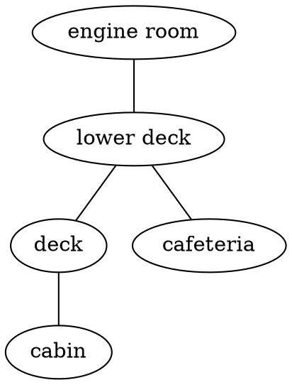
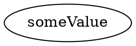
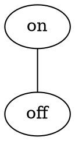
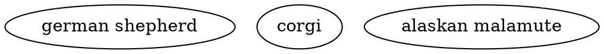
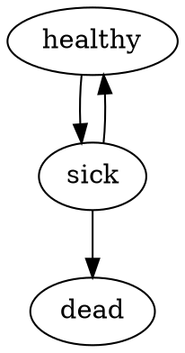
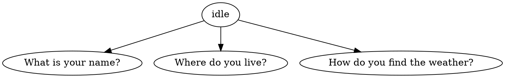
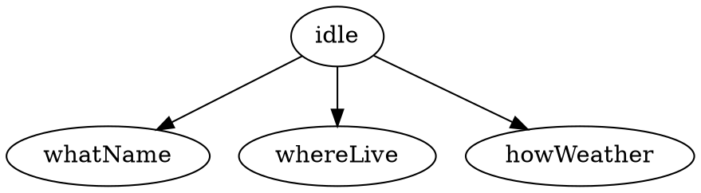
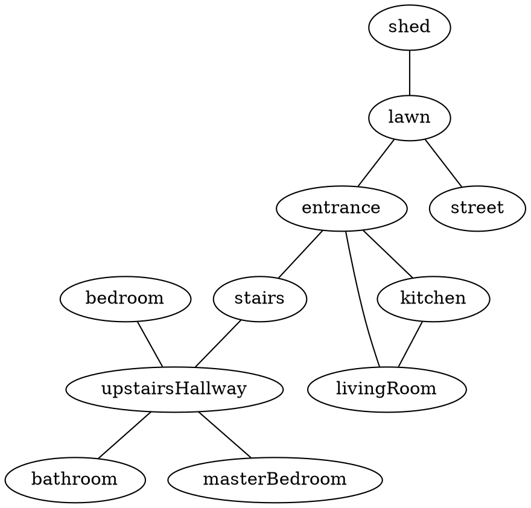
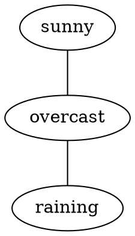

# Entities

<!-- TOC -->

- [Entities](#entities)
  - [About entities](#about-entities)
  - [Properties and values](#properties-and-values)
  - [Entity directory and files](#entity-directory-and-files)
    - [Entity directory](#entity-directory)
    - [Entity path](#entity-path)
    - [Entity files](#entity-files)
  - [Defining properties and values (".dot" files)](#defining-properties-and-values-dot-files)
    - [One-way relationships](#one-way-relationships)
  - [Defining in-game text (".md" files)](#defining-in-game-text-md-files)
    - [Value trigger](#value-trigger)
    - [Transition trigger](#transition-trigger)
    - [Messages trigger](#messages-trigger)
  - [Entity configuration (".yml" files)](#entity-configuration-yml-files)
    - [Value](#value)
    - [Actions](#actions)
    - [Child entities](#child-entities)
    - [More on entity configuration](#more-on-entity-configuration)
  - [Using aliases to shorten long values](#using-aliases-to-shorten-long-values)
  - [Organizing complex entities](#organizing-complex-entities)
    - [Splitting files](#splitting-files)
    - [Sub-dividing properties](#sub-dividing-properties)

<!-- /TOC -->

## About entities

In Adventure, every _thing_ in a story is defined in an entity. The world the 
protagonist inhabits is defined in an entity. The house they walk to is 
defined in an entity. The door they interact with is defined in an entity.

Entities are one of the two main building blocks of stories in Adventure.
Entities define what things are, and how they can change. Actions, the other
main building block in Adventure, does the changing.

## Properties and values

Entities have one or more `properties`. These are pieces of information about
the entity. For instance, a car might have one property for the engine which
tracks whether the engine is on or off, and another for the doors to track 
whether they are down or up.

All the things properties can be - "on", "off", "locked", "unlocked" are 
called `values` in Adventure. Each entity must have at least one property, 
and each property must have at least one value.

```
  ENTITIES           PROPERTIES           VALUES
  ========           ==========           ======

  vehicle -----------  doors  ----------- locked
               |                    |
               |                    ----- unlocked
               |
               ------  engine  ---------- on
                                    |
                                    ----- off

  cat    -----------  feelings  --------- happy
                                    |
                                    |---- judgemental
                                    |
                                    ----- angry
```

## Entity directory and files

### Entity directory

The files for each entity must be put inside a dedicated directory for that
entity. The name of the directory will then become the name of the entity.
For example, the entities given the directory structure below would be 
`spaceship` and `asteroid`:

```
  story/
    |- actions/
    |- entities/
    |     |- spaceship/
    |     |    |- entity.yml
    |     |    |- text.md
    |     |    |- values.dot
    |     |
    |     |- asteroid/
    |          |- entity.yml
    |          |- text.md
    |          |- values.dot
    |     
    |- story.yml
```

For organizational purposes, directories can be put inside other directories.
For example, the entity `elizabeth` can be put inside the directory `characters`
alongside all other character entities.

```
  story/
    |- actions/
    |- entities/
    |     |- characters/
    |          |- elizabeth/
    |                |- entity.yml
    |                |- text.md
    |                |- values.dot
    |
    |- story.yml
```

Directory names should not contain any spaces, and by convention, 
are lower-case.

### Entity path

Paths are used to refer to entities within Adventure. This is because 
multiple entities can have the same name and therefore using names is not
enough. For example, there are two entities named `door` in the following
example:

```
  story/
    |- actions/
    |- entities/
    |     |- house/
    |     |    |- door/
    |     |          |- entity.yml
    |     |          |- text.md
    |     |          |- values.dot
    |     |- car/
    |          |- door/
    |                |- entity.yml
    |                |- text.md
    |                |- values.dot
    | 
    |- story.yml
```

The path is the list of directories it takes to get from the `entities/` 
directory to the entity, separated by dots (`.`). In the example above, there
are two entities named `door`, but one has the path `house.door` while the
other has the path `car.door`.

Here are a few more examples of how directories translate to paths in
Adventure:

```
directory                         path in Adventure
---------                         -----------------
entities/world                 -> world
entities/places/vancouver      -> places.vancouver
entities/universe/earth/canada -> universe.earth.canada
```

### Entity files

Entities are made up of three kinds of files: 

* `.yml` or YAML files (eg. `entity.yml`)
* `.md` or Markdown files (eg. `text.md`) 
* `.dot` or Dot files (eg. `values.dot`)

Between them, they define the entirety of the entity. 

The [DOT files](https://en.wikipedia.org/wiki/DOT_\(graph_description_language\))
list all the properties and values for that entity. Entities are made up of
multiple properties, which specify an aspect of that entity. Those properties
then have values. These files look like this:



The [Markdown files](https://en.wikipedia.org/wiki/Markdown) contain all the 
text that is shown to the player in game for that entity. These files look 
like this:

```markdown
# location

## deck

You are on the deck of the ferry.

The deck has a number of benches and chairs for passengers to use. It's
windy today, so few people are out here.

You look around. The ferry is surrounded by the ocean for as far as the
eye can see.

## cabin

You are on the cabin of the ferry.

The ship's captain is here, along with the first mate. They welcome passengers
to join them in the cabin, to see them steer and navigate the ship. There
are radar screens showing the clouds that surround the ship, and a few other
blips - perhaps other vessels in the distance.
```

The [YAML files](https://en.wikipedia.org/wiki/YAML) contain everything else,
specifying the logic for the entity. The actions that can be used on each 
property, rules, child entities. These files look like this:

```yaml
location:
  value: deck
  actions: [walk]
```

Each entity can have one or more `.md`, `.dot` and `.yml` files. Simpler
entities will have one of each, named `text.md`, `values.dot` and `entity.yml`
by convention. More complex entities might have more than one of these files.

## Defining properties and values (".dot" files)

Properties and values are written using a graph description language called
[DOT](https://en.wikipedia.org/wiki/DOT_\(graph_description_language\)).

At it most simplest, it takes the following format:



Where `propertyName` would be the name of a property for the entity, and
`someValue` would be the only acceptable value for that property. Property 
names must always be preceded by the keyword `graph`. 

In reality, there would be multiple properties, and multiple values for each.
A car entity's `values.dot` file might look like this:



In the above examples, there are three properties: `engine`, `doors` and `fuel`,
each with a set of values. The `--` between values means that it can transition
between the adjoining values. For instance, the fuel cannot go from `full` to
`empty`, it must first go from `full` to `halfFull` and from `halfFull` to 
`empty`.

Properties should not contain spaces. If you want to represent
multiple words, use [camel case](https://en.wikipedia.org/wiki/Camel_case) 
notation. That means multiple words should be written like this: 
`propertyWithMultipleWords` where there's no spaces, but the words that would
follow a space normally are capitalized.

Values can contain spaces. However, when writing values, they should be 
wrapped in double-quotes:



You can validate your dot file online by putting its contents at the
[webgraphviz](http://www.webgraphviz.com/) website. It'll generate pretty
graphs representing the relationships between your values.

### One-way relationships

Uni-directional relationships can also be represented in dot files:



In the above example, a person can go from `healthy` to `sick`, and from 
`sick` to `dead`. However, they can not go back from `dead` to `sick`. It's
a one-way relationship, instead of two-way.

Note the keyword `digraph` is used instead of `graph`, to signify a directional
relationship setting. In it, all relationships are directional, 
represented with a `->`.

## Defining in-game text (".md" files)

The text shown to the player is in files written in a subset of the 
[Markdown language](https://en.wikipedia.org/wiki/Markdown).

At its most simplest, the files take on the following format:

```markdown
# propertyName

## someValue

This sentence, the one you're reading right now, would be shown to the 
player.
```

The line `## someValue` is called the trigger, and it defines the condition
for the text to appear to the player.

There are three different types of triggers: values, transitions, and messages.
More on these below.

Note that these files can contain one or more properties. Take the following
`text.md` file for a door entity, which has the properties `position` and
`condition`:

```markdown
# position

## open

The door is open.

## closed

The door is closed.

# condition

## perfect

The door is in perfect condition.

## broken

The door is broken.

## perfect -> broken

You broke the door.

## broken -> perfect

You fixed the door.
```

### Value trigger

The simplest trigger is for when the property's current value matches the 
value named in the trigger. So take a property with two values, `on` and `off`. 
Its `text.md` file might look like so:

```markdown
# flashlight

## on

The flashlight is on.

## off

The flashlight is off.
```

The `## on` trigger means that the text beneath it would only appear when the 
flashlight's value is currently `on`. Likewise for the `## off` trigger.

### Transition trigger

Another type of trigger is for when the property's value changes from one 
specified value to another. Take the following example for a cargo ship entity:

```markdown
# location

## deck

You are on the deck.

## cabin

You are in the cabin.

## wheelhouse

You are in the wheelhouse. The captain is driving the ship.

## deck -> wheelhouse

The captain waves hello to you.

## wheelhouse -> deck

The captain waves goodbye to you.

## deck -- cabin

You open the large door between the deck and cabin.
```

The `## deck -> wheelhouse` means that when the location changes from `deck`
to `wheelhouse`, the text beneath the trigger will be displayed to the player. 
This is a uni-directional relationship, marked by the `->`. This text will
not show when the location changes from `wheelhouse` to the `deck`.

The `## deck -- cabin` means that when the location changes from `deck` to 
`cabin` or vice versa, the text beneath the trigger will be shown to the player.
This is a bi-directional relationship, marked by the `--`. 

Note that the `->` and `--` of the Markdown file does not have to match the
relationships defined in the Dot file. The Dot file is about what values
a specific value can transition to. The Markdown file is about when to show
text.

### Messages trigger

The third type of trigger is for messages. These are shown programatically
by a rule in the `.yml` file. The triggers must be unique; there can't be a
value with the same name.

Take the following example:

```markdown
# location

## castle

You are in the castle.

## gameOver

Game over. You totes saved the prince!
```

The `## gameOver` is a message trigger. There is no value for the `location` 
property called `gameOver`. The message is shown to the player when there's a 
rule in the `.yml` file for the property that says `message: gameOver`.

```yml
location:
  value: home
  rules:
    castle:
      message: gameOver
```

## Entity configuration (".yml" files)

The configuration for the entity is in one or more files written in the
[YAML language](https://en.wikipedia.org/wiki/YAML). These files contain
all the rest of the information needed to make the entity do what you want.

At their most simplest, these files have the following format:

```yaml
propertyName:
  value: someValue
```

Where `propertyName` is the name of a property, and `value: someValue` means
that when that property is created, the first value it will have is `someValue`.

These files contain multiple fields, covered below.

### Value

The `value` field sets the initial value of the property.

```yaml
door:
  value: closed
```

In the example above, the initial value for the `door` property of the door
entity would be the value `closed`. This value must be listed in the `.dot`
file that has all the values.

If no value is specified, the first value Adventure loaded in will be used.
It's recommended to always have a `value` field, unless the property only 
has one value to begin with.

### Actions

The `actions` field sets the actions that can be performed on the property.

See the [documentation on actions](5_actions.md) for an explanation of what 
actions are and how they work. The important thing to take away at this time 
is that the name of these actions are needed for this property to work.

```yaml
door:
  value: ajar
  actions: [open, close, describe]
```

One or more actions can be defined. In the example above, again for the door,
the actions are `open`, `close` and `describe`.

The name of these actions are the file names for the actions in the `actions`
directory. So if there's this directory structure for the story:

```
  story/
    |- actions/
    |     |- close.yml
    |     |- describe.yml
    |     |- open.yml
    |
    |- entities/
    |     |- door/
    |          |- entity.yml
    |          |- text.md
    |          |- values.dot
    | 
    |- story.yml
```

The actions in the above example would be `close`, `describe` and `open`.

### Child entities

All entities can contain more entities. These are called child entities. 
Together, these entities make a hiearchy, starting at the root entity. For
an explanation of what the root entity is, see the documentation on 
[Story Configuration](3_storyconfig.md).

Take the `orbit` entity in the example below. It has three child entities,
`spaceship`, `astronaut`, and `satellite`. The `spaceship` entity has two
child entities, `airlock` and `engines`.

```
                            orbit
                              |
          -----------------------------------------
          |                   |                   |
      spaceship           astronaut           satellite   
          |                   |
   ---------------        inventory
   |             |
airlock       engines          
```

Child entities can be set using the `entities` field. It is written using the
following format:

```yaml
propertyName:
  entities:
    someValue:
      - someChildEntity
```

For example:

```yaml
location:
  value: bedroom
  actions: [walk, describe]
  entities:
    bedroom:
      - objects.letter
      - objects.door
    entrance:
      - objects.door
    lawn:
      - people.neighbour
```

As you might notice, child entities actually belong to a property value of
its parent entity.

These entities are then activated when the property's current value is that of
the value specified in the `entities` field. For instance, when the protagonist
is in the bedroom in the above example, there will be two entities: the 
`letter` and the `door`. 

The player will see the text and actions associated with the `location` 
property, but also the `letter` and the `door`. When the property's value
changes, these child entities are deactivated. Their state (eg. door being
open) is remembered.

### More on entity configuration

The above only covers the basics. More can be defined in the `.yml` files
for the entities. See the [documentation covering entities](6_moreentities.md)
in more detail.

## Using aliases to shorten long values

There are cases where the value of a property might be so long as to
be unwieldy in code. For instance, if an entity representing an in-game
character can say things, the conversation property might be represented
as such:



Then that text would need to be used everywhere, including the `.yml` files:

```yaml
conversation:
  value: Where do you live?
```

Aliases are a way to deal with these long values. They are shortcuts. To use
them, first write using values that are a single word. You can represent many
words with [camel case](https://en.wikipedia.org/wiki/Camel_case).

In the example above, the values file might look like so:



Then in the text file, you represent the full-text of the alias using a 
colon `:` in the trigger for the value.

```markdown
# conversation

## idle

Yes?

## whatName: What is your name?

My name is Corie Greenberg.

## whereLive: Where do you live?

I live on a boat.

## whatWeather: How do you find the weather?

I find there's lots of rain.

## idle -> whatWeather

She looks towards the sky.
```

Everywhere else, only the alias would be used, that is to say, the shortcut.

## Organizing complex entities

Individual entities can get pretty complex. There's a few strategies you can
undertake To keep things readable for large entities.

### Splitting files

Simple entities might have a single `values.dot`, `text.md`, and `entities.yml`
file that contains everything related to that entity.

However, some of these files might get very large over time. To keep things
readable for you as you write the story, it might become wise to split these
files up. Different properties can be put in different files.

As long as the files retain the file extension (`.dot`, `.md`, `.yml`), and
remain in the same directory, they can be named anything. By convention,
if there's more than one file, they should be named the property they contain.

For instance, take a `values.dot` file with the following:



It could be split up into two files, `location.dot` and `weather.dot`. 




The same strategy of putting different properties in different files can be 
applied to the text `.md` files as well. If there's a `text.md` file such as
the following:

```markdown

# location

## bedroom

You are in the bedroom.

## kitchen

You are in the kitchen.

...

# weather

## sunny

It is sunny.

## overcast

There are clouds overhead.

## raining

It is raining.
```

It could be split into two files, `location.md` and `weather.md`:

```markdown
# location

## bedroom

You are in the bedroom.

## kitchen

You are in the kitchen.

...
```

```markdown
# weather

## sunny

It is sunny.

## overcast

There are clouds overhead.

## raining

It is raining.
```

The configuration file `.yml` can also be split up. Take the following 
`entity.yml` file:

```yaml
location:
  value: bedroom

weather:
  value: sunny
```

It could be split up into `location.yml` and `weather.yml`:

```yaml
# location.yml
location:
  value: bedroom
```

```yaml
# weather.yml
weather:
  value: sunny
```

The text files are most likely to be the longest among all your entity files.
So they're the most likely candidates to get split up first. As such, the
directory for an entity could look like this:

```
  story/
    |- actions/
    |- entities/
    |     |- world/
    |          |- entity.yml
    |          |- location.md
    |          |- weather.md
    |          |- values.dot
    | 
    |- story.yml
```

Note there's a single `.yml` and `.dot` file, but multiple `.md` files.

### Sub-dividing properties

Another strategy to manage large entities is to sub-divide the structure
itself. For instance, The following `location` property has a lot of values
and can be unwieldy:


The entity can actually be sub-divided to be more clear:


The `subgraph` keyword is used to denote a graph within a graph for the dot 
file. This has no effect on the rest of the story. It's just purely for 
organizational purposes, to make it easier to edit the story.

This organization can also be done in the text file:

```markdown
# location

## house

### bedroom

You are in the bedroom.

### kitchen

You are in the kitchen.

...

### entrance

You are in the entrance.

## lawn

You are on the lawn.

## shed

You are in the shed.

## street

You are on the street.
```

Note the extra `#` in `### valueName` for the values beneath `## house`. 
Normally, text files are organized as such:

```markdown
# propertyName

## someValue

Text for someValue.
```

But it can be split up as such:

```markdown
# propertyName

## someGroupName

### someValue

Text for someValue.
```

The `someGroupName` above doesn't have to be defined anywhere else. Normally
though, it would match the name for the subgraph in the `.dot` file.

Note that just because the sub-division was done in the `.dot` file it doesn't
have to be done in the `.md` file and vice versa. The `.yml` files cannot be
organized any differently. If the `.yml` files get too complex, the only 
solution is to split it up into multiple files.

