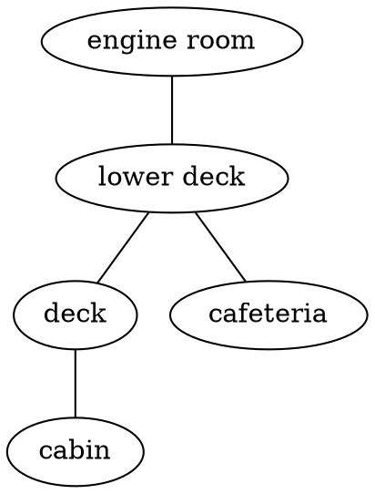
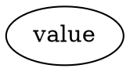
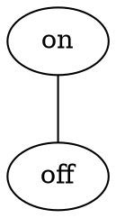
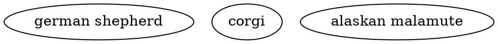
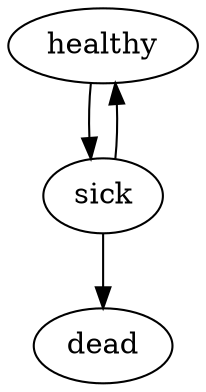
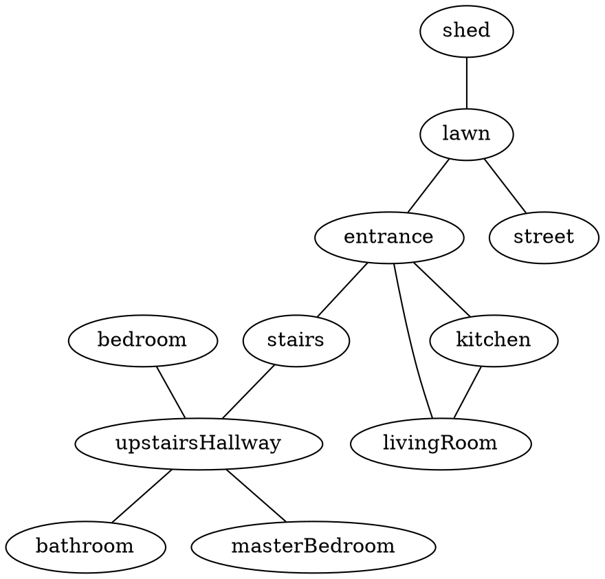
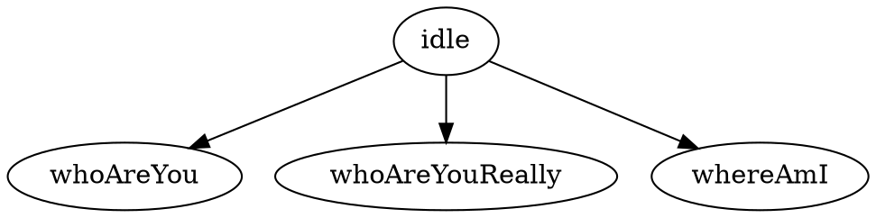

# Entities

In Adventure, every _thing_ in a story is defined in an entity. The world the 
protagonist inhabits is defined in an entity. The house they walk to is 
defined in an entity. The door they interact with is defined in an entity.

Entities are one of the two main building blocks of stories in Adventure.
Entities define what things are, and how they can change. Actions, the other
main building block in Adventure, does the changing.

## Properties and values

Entities have one or more `properties`. These are pieces of information about
the entity. For instance, a car might have one property for the engine which
tracks whether the engine is on or off, and another for the doors to track 
whether they are down or up.

All the things properties can be - "on", "off", "locked", "unlocked" are 
called `values` in Adventure. Each entity must have at least one property, 
and each property must have at least one value.

```
  ENTITIES           PROPERTIES           VALUES
  ========           ==========           ======

  vehicle -----------  doors  ----------- locked
               |                    |
               |                    ----- unlocked
               |
               ------  engine  ---------- on
                                    |
                                    ----- off

  cat    -----------  feelings  --------- happy
                                    |
                                    |---- judgemental
                                    |
                                    ----- angry
```

## Directory

The files for each entity must be put inside a dedicated directory for that
entity. The name of the directory will then become the name of the entity.
For example, the entities given the directory structure below would be 
`spaceship` and `asteroid`:

```
  story/
    |- actions/
    |- entities/
    |     |- spaceship/
    |     |    |- entity.yml
    |     |    |- text.md
    |     |    |- values.dot
    |     |
    |     |- asteroid/
    |          |- entity.yml
    |          |- text.md
    |          |- values.dot
    |     
    |- story.yml
```

For organizational purposes, directories can be put inside other directories.
For example, the entity `elizabeth` can be put inside the directory `characters`
alongside all other character entities.

```
  story/
    |- actions/
    |- entities/
    |     |- characters/
    |          |- elizabeth/
    |                |- entity.yml
    |                |- text.md
    |                |- values.dot
    |
    |- story.yml
```

Directory names should not contain any spaces, and by convention, 
are lower-case.

### Entity Paths

Paths are used to refer to entities within Adventure. This is because 
multiple entities can have the same name and therefore using names is not
enough. For example, there are two entities named `door` in the following
example:

```
  story/
    |- actions/
    |- entities/
    |     |- house/
    |     |    |- door/
    |     |          |- entity.yml
    |     |          |- text.md
    |     |          |- values.dot
    |     |- car/
    |          |- door/
    |                |- entity.yml
    |                |- text.md
    |                |- values.dot
    | 
    |- story.yml
```

The path is the list of directories it takes to get from the `entities/` 
directory to the entity, separated by dots (`.`). In the example above, there
are two entities named `door`, but one has the path `house.door` while the
other has the path `car.door`.

Here are a few more examples of how directories translate to paths in
Adventure:

```
directory                         path in Adventure
---------                         -----------------
entities/world                 -> world
entities/places/vancouver      -> places.vancouver
entities/universe/earth/canada -> universe.earth.canada
```

## Files

Entities are made up of three kinds of files: 

* `.yml` or YAML files (eg. `entity.yml`)
* `.md` or Markdown files (eg. `text.md`) 
* `.dot` or Dot files (eg. `values.dot`)

Between them, they define the entirety of the entity. 

The [DOT files](https://en.wikipedia.org/wiki/DOT_\(graph_description_language\))
list all the properties and values for that entity. Entities are made up of
multiple properties, which specify an aspect of that entity. Those properties
then have values. These files look like this:



The [Markdown files](https://en.wikipedia.org/wiki/Markdown) contain all the 
text that is shown to the player in game for that entity. These files look 
like this:

```markdown
# location

## deck

You are on the deck of the ferry.

The deck has a number of benches and chairs for passengers to use. It's
windy today, so few people are out here.

You look around. The ferry is surrounded by the ocean for as far as the
eye can see.

## cabin

You are on the cabin of the ferry.

The ship's captain is here, along with the first mate. They welcome passengers
to join them in the cabin, to see them steer and navigate the ship. There
are radar screens showing the clouds that surround the ship, and a few other
blips - perhaps other vessels in the distance.
```

The [YAML files](https://en.wikipedia.org/wiki/YAML) contain everything else,
specifying the logic for the entity. The actions that can be used on each 
property, rules, child entities. These files look like this:

```yaml
location:
  value: deck
  actions: [walk]
```

There can be one or more of each of these files for each entity. Adventure
will go through all of these files. By convention, if there's only a single
`.md` file, it's called `text.md`. If there's only a single `.dot` file, it's
called `values.dot`, and if there's only a single `.yml` file it's called 
`entity.yml`. They can, however, be called anything.

When one of these files gets too large, it's a good idea to split it into
multiple files. For instance, one file per property. So if there's too much
text in the `text.md` file for a entity that has the two properties 
`location` and `status`, then the file can be split into two: `location.md` and
`status.md`.

## Defining Properties and values (Dot files)

Properties and values are written using a graph description language called
[DOT](https://en.wikipedia.org/wiki/DOT_\(graph_description_language\)).

At it most simplest, it takes the following format:



Where `propertyName` would be the name of a property for the entity, and
`value` would be the only acceptable value for that property. Property names 
must always be preceded by the keyword `graph`. 

In reality, there would be multiple properties, and multiple values for each.
A car entity's `values.dot` file might look like this:



In the above examples, there are three properties: `engine`, `doors` and `fuel`,
each with a set of values. The `--` between values means that it can transition
between the adjoining values. For instance, the fuel cannot go from `full` to
`empty`, it must first go from `full` to `halfFull` and from `halfFull` to 
`empty`.

Properties should not contain spaces. If you want to represent
multiple words, use [camel case](https://en.wikipedia.org/wiki/Camel_case) 
notation. That means multiple words should be written like this: 
`propertyWithMultipleWords` where there's no spaces, but the words that would
follow a space normally are capitalized.

Values can contain spaces. However, when writing values, they should be 
wrapped in double-quotes:



You can validate your dot file online by putting its contents at the
[webgraphviz](http://www.webgraphviz.com/) website. It'll generate pretty
graphs representing the relationships between your values.

### One-way relationships

Uni-directional relationships can also be represented in dot files:



In the above example, a person can go from `healthy` to `sick`, and from 
`sick` to `dead`. However, they can not go back from `dead` to `sick`. It's
a one-way relationship, instead of two-way.

Note the keyword `digraph` is used instead of `graph`, to signify a directional
relationship setting. In it, all relationships are directional, 
represented with a `->`.

### Dividing up complex properties



### Long values

If the value is very long, another way to represent it is with aliases. Those
are covered in the next section.



## Defining In-game text (Markdown files)

### Aliases

## Defining entity logic (YAML files)