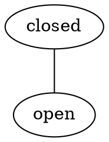
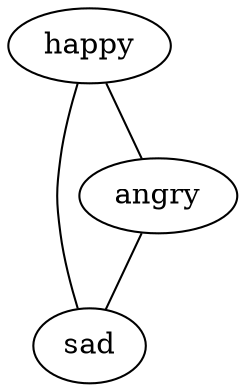

# Actions

<!-- TOC -->

- [Actions](#actions)
  - [About actions](#about-actions)
  - [Directory and file](#directory-and-file)
    - [Directory](#directory)
    - [File](#file)
  - [Name and path](#name-and-path)
  - [Types of actions](#types-of-actions)
    - [Transition](#transition)
      - [An example](#an-example)
    - [Description](#description)
      - [An example](#an-example-1)
  - [Writing the file](#writing-the-file)
    - [Action type](#action-type)
    - [Templates](#templates)
      - [Entity, property and value placeholders (@entity, @property, @value)](#entity-property-and-value-placeholders-entity-property-value)
      - [The first template acts as the example](#the-first-template-acts-as-the-example)
    - [Synonyms](#synonyms)
    - [Defaults](#defaults)
      - [Default value](#default-value)

<!-- /TOC -->

## About actions

In the [documentation on entities](4_entities.md), it was said that stories
in Adventure are made up of things called entities. A car could be an entity.
A door could be an entity. A load of bread could be an entity. It was also
said that these entities had properties, which kept track of information
about the entity.

So a car might have a property to track whether the engine is running, a 
property to track whether the doors are open, and a property to track whether
the headlights are on. A door might have a property to track whether it is
open or closed. A loaf of bread might have a property to track how fresh it
is, and another to track how much of it was eaten.

Each of these properties have values, representing all the states the property
can be. So a the property for a door tracking whether it is open has two values:
`open` and `closed`. A property for a loaf of bread tracking how much of it
was eaten could have many values: `"no slice"`, `"1 slice"`, `"2 slices"`, 
`"3 slices"`, etc.

Here are some more examples of entities, their properties, and values:

```
  ENTITIES           PROPERTIES           VALUES
  ========           ==========           ======

  spaceship ---------  radar  ----------- enabled
               |                    |
               |                    ----- disabled
               |
               ------  thrusters  ------- full thrust
                                    |
                                    |---- half thrust
                                    |
                                    ----- off

  cat    -----------  feelings  --------- happy
                                    |
                                    |---- judgemental
                                    |
                                    ----- angry
```

Entities and values are fixed. They don't change. For stories to progress, 
things have to change. The protagonist has to move and interact with the world. 
This is all done using `actions` in Adventure.

Actions can change the value in an entity's property. For example, the world 
entity has a location property, which keeps track of where the protagonist
is situated. The "walk" action will change that value to something.

Say the values for the location are "dock", "beach", "road", and "cabin". The
walk action will make it so the protagonist goes from being at one place, like
the beach, to another, like the cabin.

```
  -- location -------------------------------------------
  |                                                     |
  |     |======|                         |=======|      |
  |     | DOCK | --------- walk -------- | BEACH |      |
  |     |======|                         |=======|      |
  |                                        |   |        |
  |        --------------- walk ------------  walk      |
  |        |                                   |        |
  |     |======|                         |=======|      |
  |     | ROAD | --------- walk -------- | CABIN |      |
  |     |======|                         |=======|      |
  |                                                     |
  -------------------------------------------------------
```

In the game, each time the value changes, the game shows text for the new value.
This is the text that was specified in the entity text `.md` files, which was
convered in the [entities documentation](4_entities.md). If the location 
changes, text will be shown for the new location.

Actions are written in [YAML files](https://en.wikipedia.org/wiki/YAML). They
will look like this:

```yaml
action: transition
templates:
  - go to the @value
  - go to @value
  - go the @value
  - go @value
synonyms:
  go:
    - travel
    - walk
    - head
    - enter
```

These files will be placed in the `actions` directory and be named after
the action:

```
  story/
    |- actions/
    |     |- close.yml
    |     |- describe.yml
    |     |- open.yml
    |     |- walk.yml
    |
    |- entities/
    |- story.yml
```

## Directory and file

### Directory

Each action has its own `.yml` file and those are put in the `actions` 
directory. All the actions for all of the entities are put in this directory,
and it will look something like this:

```
  story/
    |- actions/
    |     |- close.yml
    |     |- describe.yml
    |     |- open.yml
    |     |- walk.yml
    |
    |- entities/
    |- story.yml
```

As more actions are added, for organizational purposes, sub-directories can
be created as well:

```
  story/
    |- actions/
    |     |- inspect/
    |     |    |- listen.yml
    |     |    |- look.yml
    |     |    |- smell.yml
    |     |
    |     |- movement/
    |          |- drive.yml
    |          |- walk.yml
    |
    |- entities/
    |- story.yml
```

Directory and action names should not contain any spaces, and by convention, 
are lower-case. Action names should be unique - it is advised against having
more than one action with the same name; for instance by having two `open.yml`
files in two sub-directories.

### File

Each action has its own `.yml` file, written in the 
[YAML language](https://en.wikipedia.org/wiki/YAML). The files look 
like the following:

```yaml
action: transition
templates:
  - say @value
  - say @entity @value
  - say to @entity @value
synonyms:
  say:
    - tell
    - speak
    - ask
```

What the fields like `action`, `templates`, `synonyms` mean is covered further
below.

## Name and path

The action name is the file name of the `.yml` defining the action.

```
  story/
    |- actions/
    |     |- close.yml
    |     |- describe.yml
    |     |- open.yml
    |     |- walk.yml
    |
    |- entities/
    |- story.yml
```

The actions in the example above would be `close`, `describe`, `open` and
`walk`.

If the actions are placed in a directory, the full path should be specified.
The path is the list of directories it takes to get from the `actions/` 
directory to the action `.yml` file, separated by dots (`.`). Take the 
following example:

```
  story/
    |- actions/
    |     |- inspect/
    |     |    |- listen.yml
    |     |    |- look.yml
    |     |    |- smell.yml
    |     |
    |     |- movement/
    |          |- drive.yml
    |          |- walk.yml
    |
    |- entities/
    |- story.yml
```

The path for the `listen` action would be `inspect.listen`. The path for the
`drive` action would be `movement.drive`.

Here are a few more examples of how directories translate to paths in
Adventure:

```
directory                         path in Adventure
---------                         -----------------
actions/describe.yml           -> describe
actions/car/turnon.yml         -> car.turnon
actions/body/eyes/blink.yml    -> body.eyes.blink
```

## Types of actions

There are two types of actions in Adventure: transition and description.

### Transition

Transition actions change the value of an entity's property. The name 
*transition* refers to the fact that it transitions properties from one
value to another. For instance, for a door entity, the value might transition 
from `open` to `closed`.

In addition to changing the value of a property, transition actions also 
do the following:

* Apply rules for the transition from one value to another.
* Output text for the transition from one value to another.
* Output text for the new value.
* Apply rules for the new value.

The text that is outputted in the steps above is defined in the 
[entity's text files](4_entities.md). The rules are defined in the
[entity's configuration files](4_entities.md). If there are no rules,
or no text, the step is skipped.

#### An example

Let's take a door entity as an example again, and say the entity has the
following file structure:

```
  story/
    |- actions/
    |     |- close.yml
    |     |- open.yml
    |
    |- entities/
    |     |- door/
    |          |- entity.yml
    |          |- text.md
    |          |- values.dot
    |     
    |- story.yml
```

With the following `entity.yml`:

```yaml
door:
  value: closed
  actions: [open]
  rules:
    open:
      actions: [close]
    closed:
      actions: [open]
```

And the following `text.md`:

```markdown
# door

## closed

The door is closed.

## open

The door is open.

## closed -> open

You opened the door.
```

And the following `values.dot`:



And let's say there are two actions, `close` (close the door) and `open` (open
the door), each with their own action file:

```yaml
# open.yml
action: transition
templates:
  - open the @entity
```

```yaml
# close.yml
action: transition
templates:
  - open the @entity
```

The door's initial value is `closed` and when the transition action `open`
happens, the following occurs:

* The value for the `door` property is set to `open`.
* There are no rules in the `entity.yml` file for `closed -> open`, so
  Adventure goes to the next step.
* The text for `closed -> open` is shown: "You opened the door."
* The text for `open` is shown: "The door is open."
* There are rules in the `entity.yml` file for `open`. They change the
  actions the player can use on the property with `actions: [close]`. 
  Now, the only action that can be performed is `close`.

### Description

Description actions do **not** change the value of an entity's property. 
Instead, they output the text for the property's current value. The name
*description* refers to the fact that it describes the property's current
value.

The text that is outputted in the steps above is defined in the 
[entity's text files](4_entities.md).

#### An example

Let's continue with the door entity example above. The entity has the
following file structure:

```
  story/
    |- actions/
    |     |- close.yml
    |     |- look.yml
    |     |- open.yml
    |
    |- entities/
    |     |- door/
    |          |- entity.yml
    |          |- text.md
    |          |- values.dot
    |     
    |- story.yml
```

With the following `entity.yml`:

```yaml
door:
  value: closed
  actions: [open, look]
  rules:
    open:
      actions: [close, look]
    closed:
      actions: [open, look]
```

And the following `text.md`:

```markdown
# door

## closed

The door is closed.

## open

The door is open.
```

And the following `values.dot`:


And let's say there is the action `describe`:

```yaml
# look.yml
action: description
templates:
  - look at the @entity
  - describe the @entity
```

The door's initial value is `closed` and when the description action `look`
happens, the following occurs:

* The door's current value is `closed`. The text for `closed` is shown:
  "The door is closed."

## Writing the file

The file is written using [YAML](https://en.wikipedia.org/wiki/YAML), and looks
like this:

```yaml
action: transition
templates:
  - read the @entity
  - read @entity
default:
  value: reading
```

The fields are as follows.

### Action type

The action type specifies the kind of action to be performed, whether it is
a transition or description action:

```yaml
action: transition
templates:
  - turn on @entity
```

```yaml
action: description
templates:
  - look at @entity
```

Usually most actions will be transition actions.

### Templates

Templates define the phrase(s) that the input provided by the player must be 
matched against in order for the action to be triggered.

Take the following `eat.yml` action file:

```yaml
action: transition
templates:
  - eat the @entity
  - eat @entity
  - eat
synonyms:
  eat:
    - consume
default:
  value: eaten
```

Let's say there's a `hamburger` entity with the `eat` action defined above.
Then when the player inputs the following when playing the game in Adventure,
the eat action will be applied to the hamburger:

```
eat the hamburger
```

```
eat hamburger
```

```
eat
```

```
consume the hamburger
```

```
consume hamburger
```

```
consume
```

Note that if the entity isn't specified in the player's input, and there
are two entities that can be eaten before the player (eg. hamburger and a
hot dog) then it will be ambiguous as to which entity the action applies.
Adventure will display a message accordingly.

#### Entity, property and value placeholders (@entity, @property, @value)

There are three possible placeholders in templates: `@entity`, `@property` and 
`@value`. It marks the spot where the player would fill in the entity, property
and/or value.

Having the player specify these things makes it clear to Adventure what value of
which entity/property is supposed to be changed (transition actions), or which 
entity/property is supposed to be described. Most times, having only the 
`@value` placeholder is sufficient.

When no value is specified in the input, the value in the `default` field
is used in lieu. More on the `default` below.

Let's do another example for templates, this time to speak to an 
entity with `say.yml`:

```yaml
action: transition
templates:
  - say @value
  - say @entity @value
  - say to @entity @value
synonyms:
  say:
    - tell
    - speak
    - ask
```

Let's say there's an `Eliot` entity with a `conversation` property that has
the values `"Hello there!"` and `"What is your name?"`.

The player could input the following. Note that capitalization and punctuation
are ignored by Adventure:

```
say "hello there"
```

```
ask Eliot "What is your name?"
```

```
tell eliot hello
```

In all cases the `say` action would be applied to the `Eliot` entity, changing
the value of its `conversation` property.

#### The first template acts as the example

Adventure can provide examples of input to the player. This is a list of
eligible statements the player could give to Adventure which would execute
an action on an entity. The statements cover all possible actions given
the protagonist's current situation.

When Adventure compiles this list, it only grabs the first template for each
action. If there's an action with multiple templates like so:

```yaml
action: transition
templates:
  - walk to the @value
  - walk @value
```

Then only the first template, `walk to the @value` would be chosen. If the
protagonist can walk to multiple locations, then the example input would look
like so:

```
You can:
 walk to the kitchen
 walk to the lawn
 walk to the living room
 walk to the stairs
```

### Synonyms

The `synonyms` fied is used to define synonyms for words in the templates.

Take the following action file:

```yaml
action: transition
templates:
  - walk to the @value
  - walk @value
synonyms:
  walk:
    - go
    - jog
    - run
```

There's a list of synonyms for the word `walk`. This means that `go`, `jog`
and `run` can be used in lieu of the word `walk` in the player input, and
this action will still be triggered. So the player can input the following:

```
walk to the shop
```

But they can also input the following:

```
go to the shop
```

Or this:

```
run to the shop
```

### Defaults

The defaults are used to specify defaults if placeholders are not used
in the templates.

#### Default value

If a `@value` placeholder is not specified in the template for the action,
then it could be ambiguous as to which value to transition to. For instance,
take the following `values.dot` for a dog entity:



Let's say the dog is currently `sad`. Then there are two possible values
for the dog to go to: `happy` and `angry`. If a transition action were to be
performed like the `pet` action defined in the `pet.yml` file below, it would
not be clear whether the dog should transition to `happy` or `angry`:

```yaml
action: transition
templates:
  - pet the @entity
  - pet @entity
```

Specifying a default value would make it unambiguous that the property 
representing the dog's feelings transition to `happy`:

```yaml
action: transition
templates:
  - pet the @entity
  - pet @entity
default:
  value: happy
```

