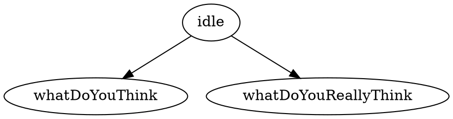
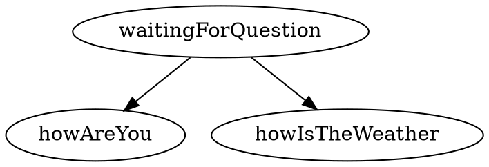
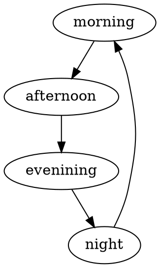

# Entity Configuration (Continued)

<!-- TOC -->

- [Entity Configuration (Continued)](#entity-configuration-continued)
  - [Overview](#overview)
  - [Initially disabled values](#initially-disabled-values)
  - [Rules](#rules)
    - [Setting the property's value](#setting-the-propertys-value)
      - [".last" value](#last-value)
    - [Displaying a message](#displaying-a-message)
    - [Disabling and enabling values](#disabling-and-enabling-values)
    - [Redefining eligible actions](#redefining-eligible-actions)
    - [Conditional rules](#conditional-rules)
      - [When action](#when-action)
      - [When property value](#when-property-value)

<!-- /TOC -->

## Overview

This documentation continues the [entity configuration](4_entities.md) section
of the entity documentation. That covered the file itself, setting the initial
value for a property with `value`, the eligible actions for that property with 
`actions`, and specified child entities with `entities`.

As a quick refresher, entity configuration files are written in the 
[YAML language](https://en.wikipedia.org/wiki/YAML) and they look something
like the following:

```yaml
location:
  value: bedroom
  actions: [go, describe]
  rules:
    entrance -- lawn:
      when entrance.objects.door.door is closed:
        message: frontDoorNotOpen
        value: .last
    upstairsHallway -- masterBedroom:
      when masterBedroom.objects.door.door is closed:
        message: masterBedroomDoorLocked
        value: .last
  entities:
    bedroom:
      - objects.letter
    entrance:
      - objects.door
    lawn:
      - people.ada
    masterBedroom:
      - objects.door
```

The fields discussed in the entity documentation were sufficient to write
many stories; the material covered in this documentation allows for more
complex behaviour.

## Initially disabled values

A property can have one or more values. Sometimes, it is desirable to disable
some of these values. Disabling values means that for all intents and purposes, 
those values do not exist until such time as they are enabled again.

For instance, for a property representing a conversation, it could be desirable 
not to have all values immediately available. If, for example, the player
should only ask "What do you really think?" after having first asked "What
do you think?". 

All values would still be represented in the `values.dot` file:



Then in the `entity.yml` file, the question "What do you really think?" could
be disabled as such:

```yaml
conversation:
  value: idle
  actions: [say]
  disabled: [whatDoYouReallyThink]
```

## Rules

Rules allow for more complex entity behaviour. Rules are a set of statements
to be executed when a condition is met. They are defined in the `rules` field.
Here's an example `entity.yml` with a few rules:

```yaml
propertyName:
  value: aValue
  rules:
    someValue:
      message: messageOne
    oneValue -- anotherValue:
      message: messageTwo
```

Rules require a trigger. There are two kinds of triggers: value triggers and
transition triggers.

Value triggers, like `someValue:` above, evaluate the statements beneath it
when the property's current value matches the value in the trigger. In the 
example above, `messageOne` is shown to the player when the property has
the value `someValue`.

Transition triggers, like `oneValue -- anotherValue:` above, evaluate the
statements beneath it when the property transitions from one value to another
specified in the trigger. In the example above, when the property's value 
changes from `oneValue` to `anotherValue`, or from `anotherValue` to `oneValue`,
the `messageTwo` is shown to the player. 

Transition triggers support bidirectional transitions like 
`oneValue -- anotherValue` as well as unidirectional transitions like
`oneValue -> anotherValue`. The former would execute statements when the 
property transitions from the left value to the right value, or the right
value to the left value. The latter would only execute when the property
transitions from the left value to the right value.

### Setting the property's value

The property's current value can be changed by using the `value` field.

At its simplest it would take the following format:

```yaml
propertyName:
  rules:
    someValue:
      value: someOtherValue
```

For example, take an entity for a character that can be conversed with. Here
would be its `values.dot` file:



Its `text.md` file:

```markdown
# conversation

## waitingForQuestion

"Yes?" says the character.

## howAreYou: "how are you?"

"I am fine!" she replies.

## howIsTheWeather: "how is the weather?"

"Oh, just dreadful", she responds.
```

And this would be its `entity.yml` file:

```yaml
conversation:
  value: waitingForQuestion
  actions: [say]
  rules:
    howAreYou:
      value: waitingForQuestion
    howIsTheWeather:
      value: waitingForQuestion
```

When the character is asked a question, you want to go back into the 
`waitingForQuestion` state as to allow the player to ask another question.
This is done by setting the value with `value: waitingForQuestion` after
the question has been asked or answered.

#### ".last" value

There is a special value that can be set called `.last`. This value sets
the property to its previous value. This only applies to transitional triggers.

Take the following example:

```yaml
door:
  value: closed
  actions: [open]
  rules:
    closed -> open:
      value: .last
      message: doorLocked
```

There is a door. The door is closed. When the door's value changes from `closed`
to `open`, the trigger `closed -> open` is executed. The `value: .last`, which
changes the value back to the last value for the door: closed. A message is
also displayed, informing the player that the door is locked. It cannot be
opened.

### Displaying a message

Messages are text displayed to the player. They are invoked using the 
`message` field.

Take an entity with the following values in its `values.dot` file:



And the following text in its `text.md` file:

```markdown
# clock

## morning

It is morning.

## afternoon

It is afternoon.

## evening

It is the evening.

## night

It is night.

## bellsChime

The clock's bells chime.
```

And the following `entity.yml`:

```yaml
clock:
  value: morning
  actions: [advanceTime]
  rules:
    morning -> afternoon:
      message: bellsChime
```

When the clock goes from `morning` to `afternoon`, the rules say to show
the message `bellsChime`: "The clock's bells chime".

The `bellsChime` message is defined in the entity's text file. It is not
defined in the values file.

### Disabling and enabling values

### Redefining eligible actions

### Conditional rules

#### When action

#### When property value