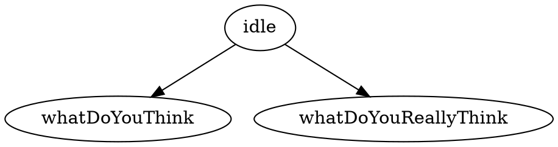
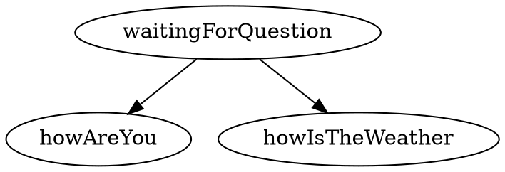
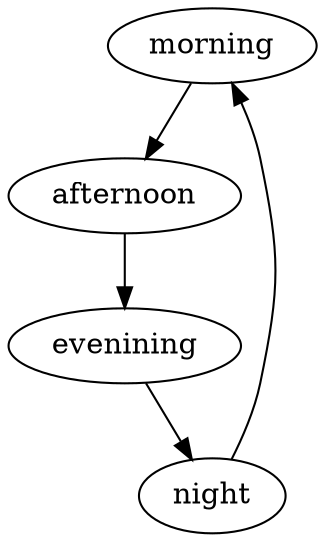

# Entity Configuration (Continued)

<!-- TOC -->

- [Entity Configuration (Continued)](#entity-configuration-continued)
  - [Overview](#overview)
  - [Disabling values initially](#disabling-values-initially)
  - [Rules](#rules)
    - [Setting the property's value](#setting-the-propertys-value)
      - [".revert" value](#revert-value)
    - [Displaying a message](#displaying-a-message)
    - [Disabling and enabling values](#disabling-and-enabling-values)
    - [Setting the eligible actions](#setting-the-eligible-actions)
    - [Adding extra conditions](#adding-extra-conditions)
      - [Condition: when an action was performed](#condition-when-an-action-was-performed)
      - [Condition: when property of a child entity has a value](#condition-when-property-of-a-child-entity-has-a-value)

<!-- /TOC -->

## Overview

This documentation continues the [entity configuration](4_entities.md) section
of the entity documentation. That covered the file itself, setting the initial
value for a property with `value`, the eligible actions for that property with 
`actions`, and specified child entities with `entities`.

As a quick refresher, entity configuration files are written in the 
[YAML language](https://en.wikipedia.org/wiki/YAML) and they look something
like the following:

```yaml
location:
  value: bedroom
  actions: [go, describe]
  rules:
    entrance -- lawn:
      when entrance.objects.door.door is closed:
        message: frontDoorNotOpen
        value: .revert
    upstairsHallway -- masterBedroom:
      when masterBedroom.objects.door.door is closed:
        message: masterBedroomDoorLocked
        value: .revert
  entities:
    bedroom:
      - objects.letter
    entrance:
      - objects.door
    lawn:
      - people.ada
    masterBedroom:
      - objects.door
```

The fields discussed in the entity documentation were sufficient to write
many stories; the material covered in this documentation allows for more
complex behaviour.

## Disabling values initially

A property can have one or more values. Sometimes, it is desirable to disable
some of these values initially. Disabling values means that for all intents and 
purposes, those values do not exist until such time as they are enabled again.

For instance, take a character entity that the protagonist can converse with.
The entity might have the following file structure:

```
  story/
    |- actions/
    |     |- say.yml
    |
    |- entities/
    |     |- character/
    |          |- entity.yml
    |          |- text.md
    |          |- values.dot
    |     
    |- story.yml
```

The character entity has a property representing a conversation. It could be 
desirable not to have all values immediately available. If, for example, the 
player should only ask "What do you really think?" after having first asked 
"What do you think?". 

All values would still be represented in the `values.dot` file:



But in the `entity.yml` file, the question "What do you really think?" would
be disabled as such:

```yaml
conversation:
  value: idle
  actions: [say]
  disable: [whatDoYouReallyThink]
```

There is no equivalent `enabled` field, as it is redundant: all values are 
enabled unless otherwise specified initially. To enable values, it takes
a rule.

## Rules

Rules allow for more complex entity behaviour. Rules are a set of statements
to be executed when a condition is met. They are defined in the `rules` field.
Here's an example `entity.yml` with a few rules:

```yaml
propertyName:
  value: aValue
  rules:
    someValue:
      message: messageOne
    oneValue -- anotherValue:
      message: messageTwo
```

Rules require a trigger. There are two kinds of triggers: value triggers and
transition triggers.

Value triggers, like `someValue:` above, evaluate the statements beneath it
when the property's current value matches the value in the trigger. In the 
example above, `messageOne` is shown to the player when the property has
the value `someValue`.

Transition triggers, like `oneValue -- anotherValue:` above, evaluate the
statements beneath it when the property transitions from one value to another
specified in the trigger. In the example above, when the property's value 
changes from `oneValue` to `anotherValue`, or from `anotherValue` to `oneValue`,
the `messageTwo` is shown to the player. 

Transition triggers support bidirectional transitions like 
`oneValue -- anotherValue` as well as unidirectional transitions like
`oneValue -> anotherValue`. The former would execute statements when the 
property transitions from the left value to the right value, or the right
value to the left value. The latter would only execute when the property
transitions from the left value to the right value.

### Setting the property's value

In the [entities documentation](4_entities.md), the `value` field was covered
to the extent of defining an initial value for the property.

The property's current value can be changed by using the `value` field
in a rule.

At its simplest it would take the following format:

```yaml
propertyName:
  rules:
    someValue:
      value: someOtherValue
```

For example, take an entity for a character that can be conversed with.
The entity would have the following file structure:

```
  story/
    |- actions/
    |     |- ask.yml
    |
    |- entities/
    |     |- juliette/
    |          |- entity.yml
    |          |- text.md
    |          |- values.dot
    |     
    |- story.yml
```

Here would be its `values.dot` file:



Its `text.md` file:

```markdown
# conversation

## waitingForQuestion

"Yes?" says the character.

## howAreYou: "how are you?"

"I am fine!" she replies.

## howIsTheWeather: "how is the weather?"

"Oh, just dreadful", she responds.
```

And this would be its `entity.yml` file:

```yaml
conversation:
  value: waitingForQuestion
  actions: [ask]
  rules:
    howAreYou:
      value: waitingForQuestion
    howIsTheWeather:
      value: waitingForQuestion
```

When the character is asked a question, you want to go back into the 
`waitingForQuestion` state as to allow the player to ask another question.
This is done by setting the value with `value: waitingForQuestion` after
the question has been asked or answered.

#### ".revert" value

There is a special value that can be set called `.revert`. This value sets
the property to its previous value. This only applies to transitional triggers.

Take the following example:

```yaml
door:
  value: closed
  actions: [open]
  rules:
    closed -> open:
      value: .revert
      message: doorLocked
```

There is a door. The door is closed. When the door's value changes from `closed`
to `open`, the trigger `closed -> open` is executed. The `value: .revert`, which
changes the value back to the last value for the door: closed. A message is
also displayed, informing the player that the door is locked. It cannot be
opened.

### Displaying a message

Messages are text displayed to the player. They are invoked using the 
`message` field. The text for the message is defined in the entity's text
file.

Take a clock entity with the following file structure:

```
  story/
    |- actions/
    |     |- advanceTime.yml
    |
    |- entities/
    |     |- clock/
    |          |- entity.yml
    |          |- text.md
    |          |- values.dot
    |     
    |- story.yml
```

With the following `values.dot` file:



And the following text in its `text.md` file:

```markdown
# clock

## morning

It is morning.

## afternoon

It is afternoon.

## evening

It is the evening.

## night

It is night.

## bellsChime

The clock's bells chime.
```

And the following `entity.yml`:

```yaml
clock:
  value: morning
  actions: [advanceTime]
  rules:
    morning -> afternoon:
      message: bellsChime
```

When the clock goes from `morning` to `afternoon`, the rules say to show
the message `bellsChime`: "The clock's bells chime".

Notice that the `bellsChime` message is defined in the entity's text file, but
not in the the values `values.dot` file. This is because messages are not 
values. They only need be defined in the text file.

### Disabling and enabling values

In a previous section, it was shown how to disable values. That is to say,
that for all intents and purposes, those values do not exist until such time 
as they are enabled again.

The `enable` and `disable` fields allow values to be enabled/disabled in
a story.

For instance, for a property representing a conversation, it could be desirable 
not to have all values immediately available. If, for example, the player
should only ask "What do you really think?" after having first asked "What
do you think?". 

All values would still be represented in the `values.dot` file:


Then in the `entity.yml` file, the question "What do you really think?" could
be disabled with `disable: [whatDoYouReallyThink]`:

```yaml
conversation:
  value: idle
  actions: [say]
  disable: [whatDoYouReallyThink]
  rules:
    whatDoYouThink:
      enable: [whatDoYouReallyThink]
      disable: [whatDoYouThink]
      value: idle
```

Then, when the player asks "what do you think?", the rules for `whatDoYouThink`
are executed: 

* Enable "what do you really think?" (`whatDoYouReallyThink`)
* Disable "what do you think?" (`whatDoYouThink`)
* Set the value for the property back to `idle` so the player is able
  to ask the question.

### Setting the eligible actions

In the [entities documentation](4_entities.md), the `actions` field was covered
to the extent of defining the list of eligible actions for the property.

The list of eligible actions for a property can also be changed after the
fact with the `actions` field in a rule.

Take the following example:

```yaml
door:
  value: closed
  actions: [open, describe]
  rules:
    open:
      actions: [close, describe]
    closed:
      actions: [open, describe]
```

There is a door. The door is closed. Initially, there are two actions that can
be performed on the door: `open` and `describe`. The rules dictate that when
the door is `open`, the actions that can be performed on the door change:
the `open` action is no longer eligible, replaced with a `close` action. The
`describe` action remains.

### Adding extra conditions

All rules are conditional in that they only execute when a condition is met,
defined by the trigger. Take the example below:

```yaml
engine:
  value: off
  actions: [turnOn]
  rules:
    off -> on:
      message: vehicleSputtersSmoke
    on:
      actions: [turnOff]
```

The trigger `off -> on` is a condition, one which only executes the statements
below it when the engine goes from off to on. Same with the `on` trigger. 
However, there are additional conditions which can be applied to rules.

```yaml
engine:
  value: off
  actions: [turnOn, turnOff]
  rules:
    off -> on:
      when turnOff:
        message: engineAlreadyOff
        value: .revert
    on -> off:
      when turnOn:
        message: engineAlreadyOn
        value: .revert
```

In the above example, a second condition, `when turnOff` and `when turnOn`
are added. So now, when the player turns off the engine when the engine
is already off, the message for `engineAlreadyOff` is displayed.

#### Condition: when an action was performed

A condition in which the statements beneath it are only executed when a
specific action was performed takes the following format:

```yaml
propertyName:
  rules:
    someValue -> anotherValue:
      when actionName:
        message: someMessage
```

The format of the condition is `when <actionName>`. This conditional only
applies to transitional triggers. Value triggers take place after after the
transition has completed and do not therefore have an associated action.

Take the example of a door:

```yaml
door:
  value: closed
  actions: [close, open]
  rules:
    closed -> open:
      when close:
        message: doorAlreadyClosed
        value: .revert
    open -> closed:
      when open:
        message: doorAlreadyOpen
        value: .revert
```

Let's say that the player tries to close the door with the `close` action 
while the door is already closed (property's current value is `closed`):

* The `closed -> open:` rule is triggered. This is counter-intuitive: the
  player used the `closed` action, so why would the door transition to `open`?
  This is because what the action is called is irrelevant. All transition 
  actions behave the same way, no matter what their name. The `close` action
  is identical in behaviour to the `open` action. They both change the value.
  The door was closed. An action to change the value was invoked. The door's
  value changed to open.
* The `when close:` conditional is checked. The rules that follow are only
  executed when the action that triggered the change is the `close` action.
  This is the case in this example.
* Show the `doorAlreadyClosed` message, which informs the player that the
  door was already closed.
* Revert the property's value back to what it was using the special `.revert`
  value. The value had been changed to `open`; it's now back to `closed`.

#### Condition: when property of a child entity has a value

There is another type of condition that can be added, that executes statements
only when a child entity of the property has a specific value.

Take the following example:

```yaml
location:
  value: bedroom
  actions: [walk]
  rules:
    entrance -- lawn:
      when entrance.objects.door.door is closed:
        message: frontDoorNotOpen
        value: .revert
    upstairsHallway -- masterBedroom:
      when masterBedroom.objects.door.door is closed:
        message: masterBedroomDoorLocked
        value: .revert
  entities:
    entrance:
      - objects.door
    masterBedroom:
      - objects.door
```

There is a `door` entity in the `entrance` value, as well as in the
`masterBedroom` value. Let's look at the rule more closely:

```yaml
location:
  ...
  rules:
    entrance -- lawn:
      when entrance.objects.door.door is closed:
        message: frontDoorNotOpen
        value: .revert
```

Note the `when entrance.objects.door.door is closed` conditional.

The format of the conditional is: 

```
when <value.childEntityPath.childProperty> is <childPropertyValue>:
```

This is the logic:

* When the protagonist attempts to go from the entrance to the lawn...
* When the door entity in the entrance has the current value `closed`...
* Show a message that the door is not open
* Revert the value, so if the player

The full path does not have to be specified. If there was one door instead
of two, this format for the conditional would have worked:

```
when <childProperty> is <childPropertyValue>:
```

So while this worked:

```yaml
location:
  ...
  rules:
    entrance -- lawn:
      when entrance.objects.door.door is closed:
        message: frontDoorNotOpen
        value: .revert
```

So too would have this:


```yaml
location:
  ...
  rules:
    entrance -- lawn:
      when door is closed:
        message: frontDoorNotOpen
        value: .revert
```

The full path is only necessary when there are multiple matches that would
make the conditional ambiguous as to which entity is supposed to be looked at
for the value.

Adventure looks right-to-left of the first field for the first eligible match.
Going back to the example above, if there was only one door, all these
conditions would have worked:

* `when entrance.objects.door.door is closed:`
* `when objects.door.door is closed:`
* `when door.door is closed:`
* `when door is closed:`

The conditional can also look at child entities of child entities, with the
format:

```
when <value.childEntityPath.childProperty.childValue
     .childChildEntityPath.childChildProperty> is <childChildPropertyValue>:
```