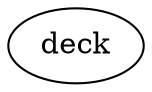

# Writing Your First Story

## Basic concepts

### Adventure

Adventure is a tool to create and play text adventure games. In these 
games, there is a protagonist that is controlled by a player. The protagonist 
explores a world, solves puzzles, talks to characters, and does all the things
you might read in a book. The player controls the protagonist by writing 
sentences in plain English. The game understands these sentences and writes
out text about what happens next.

### Entities, properties and values

Stories in Adventure are made up of things, called `entities`. Everything is 
an entity in Adventure. The world the protagonist navigates is an entity. 
The door the protagonist might interact with is an entity. The protagonist's 
inventory is an entity.

Entities have one or more `properties`. These are pieces of information about
the entity. For instance, a car might have one property for the engine which
tracks whether the engine is on or off, and another for the doors to track 
whether they are down or up.

All the things properties can be - "on", "off", "locked", "unlocked" are 
called `values` in Adventure. Each entity must have at least one property, 
and each property must have at least one value.

```
  ENTITIES           PROPERTIES           VALUES
  ========           ==========           ======

  vehicle -----------  doors  ----------- locked
               |                    |
               |                    ----- unlocked
               |
               ------  engine  ---------- on
                                    |
                                    ----- off

  cat    -----------  feelings  --------- happy
                                    |
                                    |---- judgemental
                                    |
                                    ----- angry
```

### Actions

For stories to progress, things have to change. The protagonist has to move 
and interact with the world. This is all done using `actions` in Adventure.

Actions change the value in an entity's property. For example, the world 
entity has a location property, which keeps track of where the protagonist
is situated. The "walk" action will change that value to something.

Say the values for the location are "dock", "beach", "road", and "cabin". The
walk action will make it so the protagonist goes from being at one place, like
the beach, to another, like the cabin.

```
  -- location -------------------------------------------
  |                                                     |
  |     |======|                         |=======|      |
  |     | DOCK | --------- walk -------- | BEACH |      |
  |     |======|                         |=======|      |
  |                                        |   |        |
  |        --------------- walk ------------  walk      |
  |        |                                   |        |
  |     |======|                         |=======|      |
  |     | ROAD | --------- walk -------- | CABIN |      |
  |     |======|                         |=======|      |
  |                                                     |
  -------------------------------------------------------
```

In the game, each time the value changes, the game shows text for the new value.
So if the location changes, text will be shown for the new location. If the
protagonist were to arrive at the beach, it might look something like:

```
You are now at the beach.

The waves of the water gently roll against the fine sand.
```

If you don't understand how things work quite yet, don't worry. You don't
need to understand everything to write your first story. Follow the steps
below, explore, and try things out!

## Writing your first story

These instructions will put together a simple story set on a ferry.

### Before starting

Make sure you can run the `adventure` command. If you can't, follow the 
installation instructions in the README.

### Create the directories

Stories are stored in a directory. This directory must two sub-directories: 
`actions` and `entities`.

```
  myStory/
    |- actions/
    |- entities/
```

Go ahead and create a directory for your story. Then create the `actions` and
`entities` directories inside of it.

### Create the "story.yml" file

The most important file for Adventure is the `story.yml` file that's in the
main story directory. It is where important information like the title for the
story and the author is kept.

Create a `story.yml` file now. It should go in the main story directory:

```
  myStory/
    |- actions/
    |- entities/
    |- story.yml
```

Open the `story.yml` file and put the following inside:

```yml
title: My First Story
author: Maëlys McArdle
description: This story takes place on a ferry.
entity: ferry
```

Replace `Maëlys McArdle` with your name, and make up a new title instead of 
`My First Story`. Leave the rest there.

### Create the ferry entity

Go into the `entities` directory, and create another directory called `ferry`.
At this point, your story directory should look like so:

```
  myStory/
    |- actions/
    |- entities/
    |     |- ferry/
    |
    |- story.yml
```

Inside the `ferry` directory, create a file called `entity.yml`. Open this
file and put in the following:

```yaml
location:
  value: deck
```

The ferry entity has one property, called `location`. The current value is
the deck. Meaning, the protagonist's location is the deck.

Now create a file called `text.md`. Open this file and put in the following:

```markdown
# location

## deck

You are on the deck of the ferry.

The deck has a number of benches and chairs for passengers to use. It's
windy today, so few people are out here.

You look around. The ferry is surrounded by the ocean for as far as the
eye can see.
```

That file contains the things that will be written out by the game when
the protagonist is on the deck.

Finally, create a file called `values.dot`. Open this file and put in the
following:



Your story directory should now look like so:

```
  myStory/
    |- actions/
    |- entities/
    |     |- ferry/
    |          |- entity.yml
    |          |- text.md
    |          |- values.dot
    |
    |- story.yml
```

### Try it out!

You've got everything now to play this story. Start up Adventure:

```bash
adventure
```

Then run the command to load a new story.

```
start myStory
```

You should now see the following:

```
> start examples/firststory
Loaded My First Story

You are on the deck of the ferry.

The deck has a number of benches and chairs for passengers to use. It's
windy today, so few people are out here.

You look around. The ferry is surrounded by the ocean for as far as the
eye can see.
```

At this point, there's nothing for the player to do. There needs to 
be an action!

### Create the walk action

